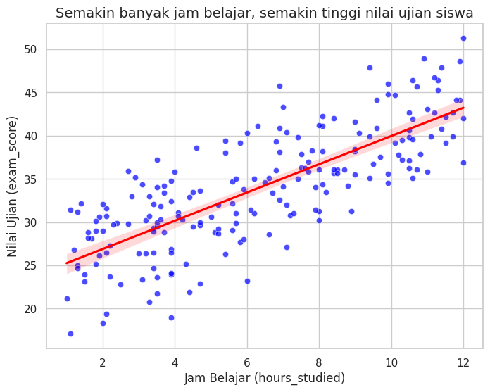
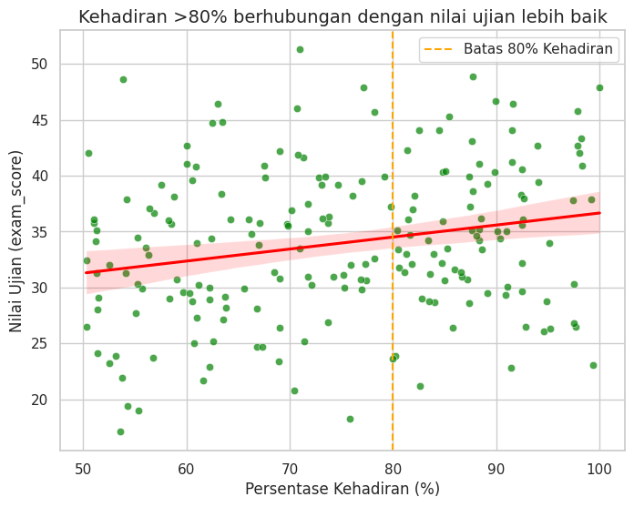
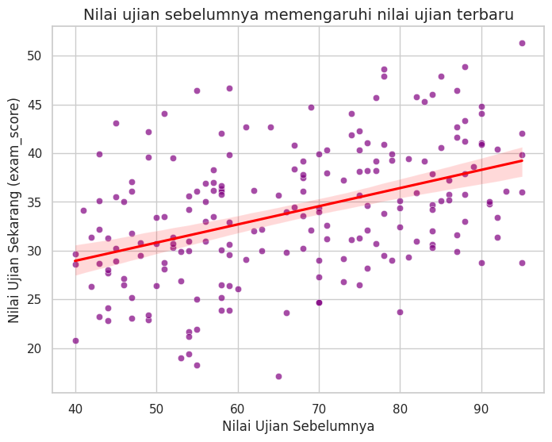
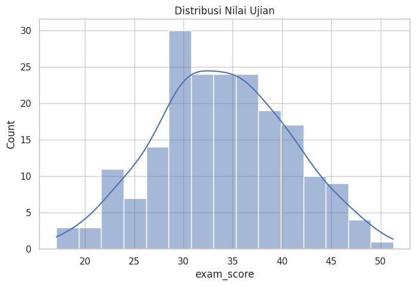
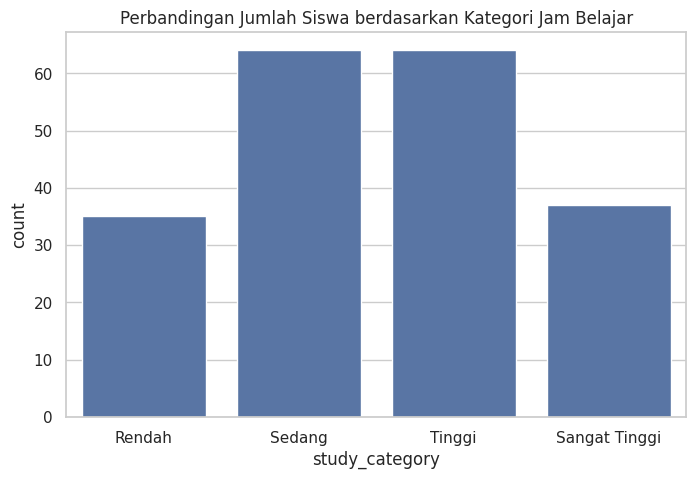
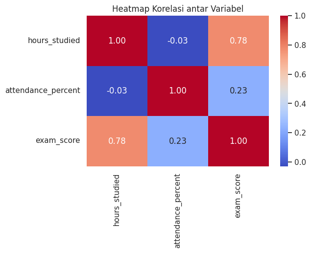

# Student Exam Score Analysis

## Project Overview

This project analyzes factors affecting students' exam scores using Python. The analysis includes data cleaning, exploratory data analysis (EDA), statistical analysis, and data visualization to identify the relationship between study habits and academic performance.

---

## Dataset

**Source:**  
https://www.kaggle.com/datasets/mirzayasirabdullah07/student-exam-scores-dataset

**Dataset Information**

- Number of Students: 200
- Features:
  - Student ID
  - Hours Studied
  - Sleep Hours
  - Attendance Percentage
  - Previous Scores
  - Exam Score

---

## Project Objectives

- Clean and prepare the dataset for analysis.
- Explore the characteristics of student performance.
- Visualize relationships between study habits and exam scores.
- Measure the strength of relationships using Pearson Correlation.
- Generate actionable insights from the data.

---

## Tools & Libraries

- Python
- Google Colab
- Pandas
- NumPy
- Matplotlib
- Seaborn
- SciPy

---

## Repository Structure

```
student-exam-score-analysis
│
├── data
│   ├── raw
│   └── processed
│
├── notebooks
│   ├── 01_data_cleaning.ipynb
│   ├── 02_exploratory_data_analysis.ipynb
│   ├── 03_data_visualization.ipynb
│   └── 04_statistical_analysis.ipynb
│
├── images
│
├── README.md
├── requirements.txt
├── LICENSE
└── .gitignore
```

---

## Project Workflow

1. Import Dataset
2. Data Cleaning
3. Exploratory Data Analysis (EDA)
4. Data Visualization
5. Pearson Correlation Analysis
6. Business Insights
7. Conclusion

---

## Visualizations

### Study Hours vs Exam Score



---

### Attendance vs Exam Score



---

### Previous Score vs Exam Score



---

### Distribution of Exam Scores



---

### Study Category Distribution



---

### Correlation Heatmap



---

## Key Findings

- Study hours have a **strong positive correlation** with exam scores (**r = 0.78**).
- Attendance has a **weak but statistically significant positive relationship** with exam scores (**r = 0.23**).
- Previous academic performance is positively associated with future exam performance.
- Students who study more consistently tend to achieve higher exam scores.

---

## Statistical Analysis

**Method Used**

- Pearson Correlation

**Results**

| Variable | Correlation (r) | Interpretation |
|-----------|----------------:|---------------|
| Hours Studied vs Exam Score | 0.78 | Strong Positive |
| Attendance vs Exam Score | 0.23 | Weak Positive |

Both relationships are statistically significant (p < 0.05).

---

## How to Run

Clone this repository

```bash
git clone https://github.com/hannazan/student-exam-score-analysis.git
```

Install required libraries

```bash
pip install -r requirements.txt
```

Open the notebooks in Jupyter Notebook or Google Colab.

---

## Conclusion

The analysis shows that study time is the most influential factor associated with students' exam scores. While attendance also contributes to better performance, its impact is considerably weaker. These findings highlight the importance of effective study habits in improving academic achievement.

---

## Author

**Hanna Zahra Nadia**

Mathematics Graduate | Aspiring Data Analyst & Data Scientist

LinkedIn: *linkedin.com/in/hannazan*

GitHub: https://github.com/hannazan
